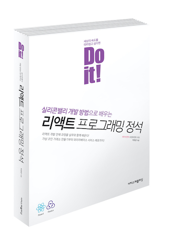

# ES6문법 정리하기
DOit! 리액트 프로그래밍 정석의 2단원을 참고하여 ES6문법에 대한 부분을 정리.

## 목차
[02-1 템플릿 문자열](#02-1-템플릿-문자열) 
[02-2 전개 연산자](#정리#02-2-전개-연산자) 
[02-3 가변 변수와 불변 변수](#정리#02-3-가변-변수와-불변-변수) 
[02-4 클래스](#정리#02-4-클래스) 
[02-5 화살표 함수](#정리#02-5-화살표-함수) 
